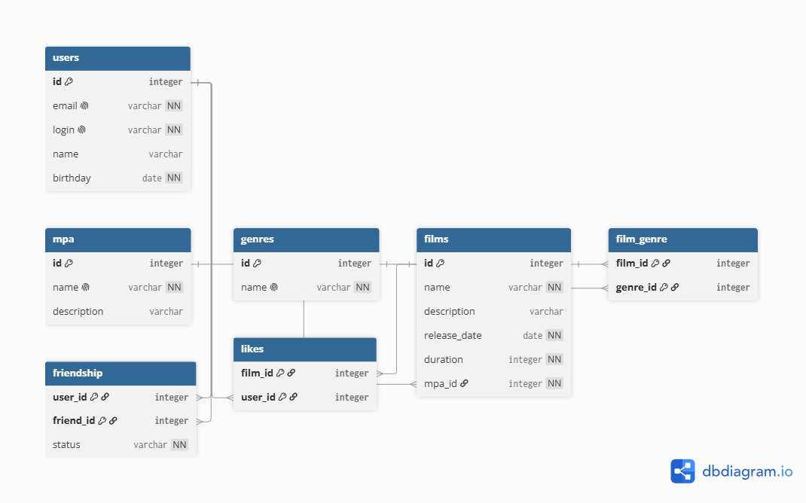

# Filmorate - приложение для обмена впечатлениями о фильмах

## ️ Схема базы данных



Схема спроектирована в соответствии с третьей нормальной формой (3NF). Все неключевые атрибуты зависят только от первичного ключа, массивы в столбцах отсутствуют.

### Примеры SQL-запросов для основных операций

#### 1. Получить топ-10 самых популярных фильмов

```sql
SELECT f.id, f.name, COUNT(l.user_id) AS likes_count
FROM films f
LEFT JOIN likes l ON f.id = l.film_id
GROUP BY f.id, f.name
ORDER BY likes_count DESC, f.id ASC
LIMIT 10;

Получить список подтвержденных друзей пользователя с ID = 1

SELECT u.id, u.name, u.login, u.email
FROM users u
JOIN friendship f ON u.id = f.friend_id
WHERE f.user_id = 1 AND f.status = 'confirmed';

Получить список общих подтвержденных друзей пользователей с ID = 1 и ID = 2

SELECT u.id, u.name, u.login
FROM users u
JOIN friendship f1 ON u.id = f1.friend_id AND f1.user_id = 1 AND f1.status = 'confirmed'
JOIN friendship f2 ON u.id = f2.friend_id AND f2.user_id = 2 AND f2.status = 'confirmed';

Получить фильм со всеми его жанрами и рейтингом MPA

SELECT f.id, f.name, m.name AS mpa_rating, STRING_AGG(g.name, ', ') AS genres
FROM films f
JOIN mpa m ON f.mpa_id = m.id
LEFT JOIN film_genre fg ON f.id = fg.film_id
LEFT JOIN genres g ON fg.genre_id = g.id
WHERE f.id = 1
GROUP BY f.id, f.name, m.name;
```